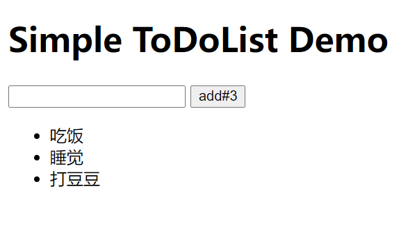
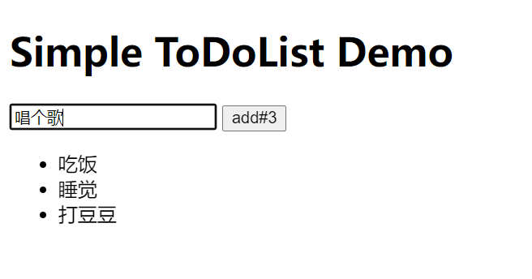
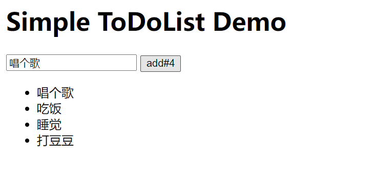

# react-todolist

用react简单实现的todolist，能够简单实现统计todolist事件的数量，添加事件等

这个例子也是我在学react中的简单小案例，希望能给react初学者一点帮助

# 使用方法

直接clone到本地之后，直接运行html文件即可

# 效果展示

主要分成三个组件,其中APP是主组件，输入框和按钮形成一个Add组件，List形成一个组件；

标题写在APP组件中，可以添加事件：

